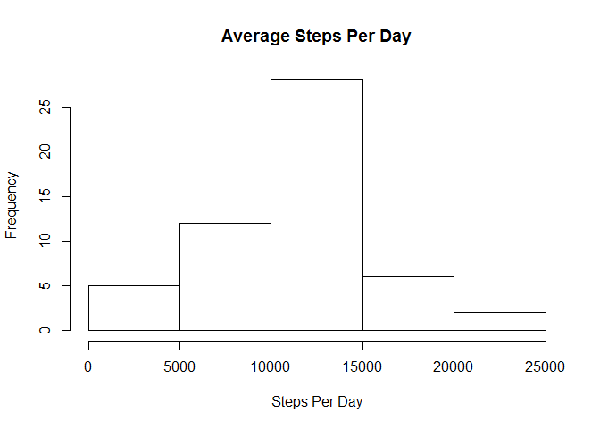
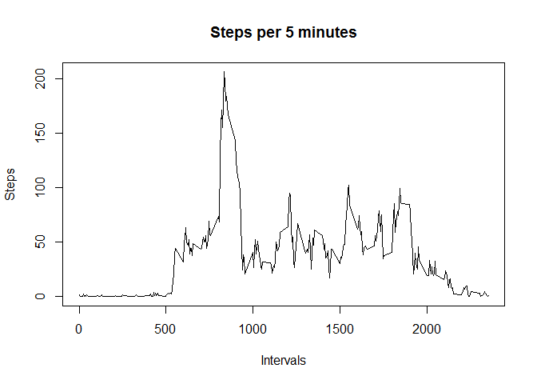
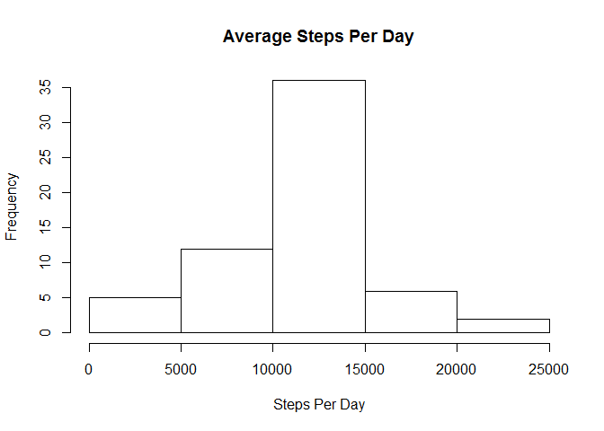
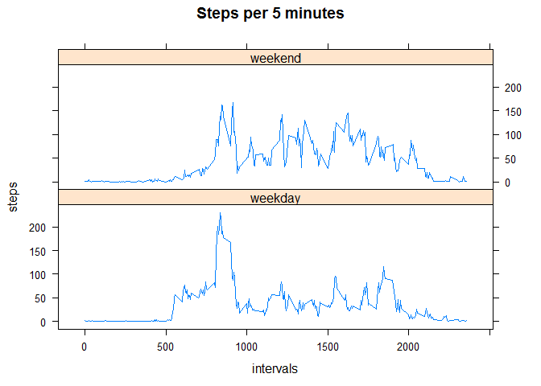

# Reproducible Research: Peer Assessment 1

## Loading and preprocessing the data

Download the file from the internet.


```r
download.file("http://d396qusza40orc.cloudfront.net/repdata%2Fdata%2Factivity.zip", "activity.zip")
```

Unzip the file.


```r
unzip("activity.zip")
```

Load the file.


```r
activity <- read.csv("activity.csv", na.strings="NA",
                     stringsAsFactors=F)
```


## What is mean total number of steps taken per day?

Calculate the total number of steps per day.


```r
steps <- aggregate(steps ~ date, sum, data=activity, na.action=na.omit)
```

Graph the number of steps per day.


```r
hist(steps$steps, main="Average Steps Per Day", xlab="Steps Per Day")
```

 

Mean of steps per day.


```r
mean(steps$steps)
```

```
## [1] 10766.19
```

Median of steps per day.


```r
median(steps$steps)
```

```
## [1] 10765
```

## What is the average daily activity pattern?


```r
intdata <- aggregate(steps ~ interval, mean, data=activity, 
                     na.action=na.omit)

plot(intdata$interval, intdata$steps, type="l", 
     main="Steps per 5 minutes", xlab="Intervals", ylab="Steps")
```

 

What interval did the subject usually take the most steps in?


```r
intdata[intdata$steps == max(intdata$steps),]
```

```
##     interval    steps
## 104      835 206.1698
```

## Imputing missing values

How many missing values are in our data set?


```r
sum(is.na(activity$steps))
```

```
## [1] 2304
```

Replace NA values with the interval average.
We will replace each missing step count with the average number of steps for that step counts interval.


```r
for(i in 1:length(activity$steps)) {
  if(is.na(activity[i,1])) {
    activity[i,1] <- intdata[intdata$interval == activity[i,3], 2]
  }
}
```

Re-graph the total number of steps per day with missing data filled in.
Does it make a big difference?
Is there any difference?


```r
steps <- aggregate(steps ~ date, sum, data=activity, na.action=na.omit)
hist(steps$steps, main="Average Steps Per Day", xlab="Steps Per Day")
```

 

Mean of steps per day.


```r
mean(steps$steps)
```

```
## [1] 10766.19
```

Median of steps per day.


```r
median(steps$steps)
```

```
## [1] 10766.19
```

It seems that the averages do not change, we just see the previous findings re-affirmed.

## Are there differences in activity patterns between weekdays and weekends?

Is our subject lazier on the weekends?


```r
activity$date <- as.Date(activity$date)

activity$day <- activity$steps

for(i in 1:length(activity$day)) {
  if(weekdays(activity[i,"date"]) == "Sunday") {
    activity[i,"day"] <- "weekend"
  }else if(weekdays(activity[i,"date"]) == "Saturday") {
    activity[i,"day"] <- "weekend"
  }else{
    activity[i,"day"] <- "weekday"
  }
}

activity$day <- as.factor(activity$day)

weekends <- activity[activity$day == "weekend",]
weekends <- aggregate(steps ~ interval, mean, data=weekends, 
                     na.action=na.omit)
weekends$day <- rep.int("weekend", length(weekends$steps))

weekdays <- activity[activity$day == "weekday",]
weekdays <- aggregate(steps ~ interval, mean, data=weekdays, 
                     na.action=na.omit)
weekdays$day <- rep.int("weekday", length(weekends$steps))

intdata <- rbind(weekdays, weekends)

library(lattice)
xyplot(steps ~ interval | day, data = intdata, layout=c(1,2),
       main = "Steps per 5 minutes", xlab="intervals", ylab="steps",
       type="l")
```

 

It seems that the subject does not take a large difference in steps.
On weekdays the steps are focused in the morning.
On weekends they are more spread out.
It almost looks like the subject takes more steps on weekends.

Weekend average per 5 minute interval.

```r
mean(weekends$steps)
```

```
## [1] 42.3664
```

Weekday average per 5 minute interval.

```r
mean(weekdays$steps)
```

```
## [1] 35.61058
```
